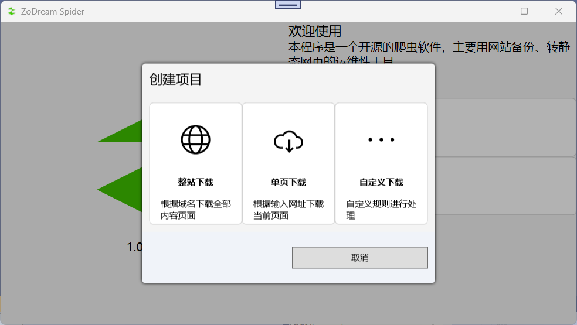

# ZoDream Spider

## 预览图

## 主要结构

> 主页面 显示所有网址及执行情况  包括停止开始

### 操作:
1. 任务保存载入
2. 停止继续暂停开始

> 添加页面 初始网址 规则列表 请求头设置列表

### 参数：

1. 网址 【】
2. 线程数 【】
3. 等待时间 【】
4. 是否使用浏览器 【】
5. 保存路径 【】
    
### 操作：

1. 规则管理
2. 规则保存载入

> 规则页面 网址匹配 及对应的规则

### 规则组：

1. 支持域名匹配
2. 支持正则匹配
3. 支持事件：`event:done` 全部网址执行完成后进行的操作
4. 对一个网址可以多个规则组

### 具体规则:

|规则名|参数1|参数2|说明|
|:--:|:--:|:--:|:--|
|正则截取|正则表达式|提取标签|不会改变数据的结果，比如 字符串不会变成数组
|普通截取|开始字符|结束字符|不包括开始结束字符
|普通替换|||
|正则替换|||
|正则匹配||提取标签|会把字符串变成数组，如果第二个参数为空，则所有的标签也会保存，保存成json 会保存为关联数组
|简繁转换|Y/N||Y或为空时表示 繁体转简体 其他字符表示简体转繁体
|XPath选择|选择器|Y/N|会把字符串变成数组
|Csv保存|正则|路径|正则必须带标签，第一行为标签
|Excel保存|正则|路径|同上
|保存||模板路径|支持保存为html txt(特指5匹配得到的列表) 如果为文件直接执行本操作，如果为
|POST保存|提交网址|post参数模板|支持接口导入 `${url}`表示网址 `${content}`表示内容 `${}`表示正则标签
|追加||模板路径|
|直接下载|保存路径||不执行后续规则
|去HTML化 |||删除html标签，转化一些特殊字符
|提取默认链接|||提取 标签含有 src href 属性的链接，提取css 中 url 链接
|自定义网址|正则|正则规则组名|
|合并字符串|连接的字符串||
|JQuery查询|选择器|Y/N|
|JQuery提取属性|选择器|属性名|
|拆分|||把为 RuleArray 拆分一个个单独的任务 执行
|载入二级页面|属性名||指定属性名名作为网址进行加载，并把当前的属性都继承给下一个任务
|自动小说下载|||基于元素密集程度自动识别内容和章节页，单线程下载，自动重试3次，合并成一个字符串
|合并文件|规则组名，可以自定义正则|路径，可以使用`${host}`或`${}`表示第一个参数中的正则标签，从而分成多个文件|把符合规则组的网址的内容进行合并成一个文件，建议放在 event:done 规则组下

    
### 操作：

1. 具体规则管理

### 说明：

1. 路径 支持正则匹配标签 `{}`，有默认地址，所有替换的地址是相对默认地址路径，使用相对路径是基于保存路径
2. 支持`dll` 导入规则，`dll` 名必须以 `Rule.dll` 结尾, 规则必须实现 `ZoDream.Shared.Interfaces.IRule` 接口，放在主程序文件夹下即可
3. `jQuery`、`XPath` 选择器支持 `.text()` 结尾的方式获取属性值， 例如： `.text()` 获取 `.innerTEXT`； .html() 获取 `.innerHTML`；`.src()` 获取 `src` 的属性；
    
> 浏览器页面
    
自动获取请求头

> 支持自定义代理

添加代理地址

> 手动添加网址

支持网址生成： `${}` 为标记，例如：`${1...99}` 生成从 1 开始的 99 个网址，适用于分页连接； `${desc,asc}` 生成两个网址分别以 `desc` `asc` 进行替换

## 流程

加载初始网址

装配下载请求头

获取源码

提取url 并替换url为相对路径

循环匹配url规则组

> 循环执行对应规则， 执行下一项需要手动调用 `await ISpiderContainer.NextAsync()`

## 已实现功能

1. 多线程下载
2. 支持浏览器下载
3. 支持多格式保存
4. 支持多种规则提取
5. 支持 host 域名映射
6. 支持文件下载进度显示
7. 规则配置专属控件显示，增加配置的灵活和可读性
8. 当一个规则组的规则为空时，则为不爬取规则

## 未定功能

1. 分布式爬取，类似搜索引擎抓取全部网页
2. 直接从浏览器手动执行，例如：增加一个按钮，点击之后执行相关规则
3. 浏览器中点击事件触发，例如：有些单页应用不是通过网址跳转的，而是触发相关事件使用脚本跳转
4. 支持视频合并下载

## 已知问题

1. 在浏览器中，通过设置 Host 请求头实现自定义域名映射无法实现，老是页面无法访问 ERR_INVALID_ARGUMENT

## 更新时间

    2023/11/02 17:26